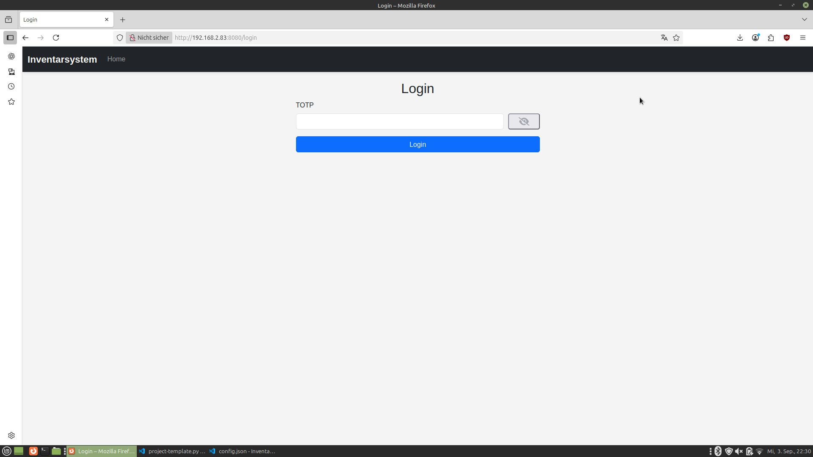
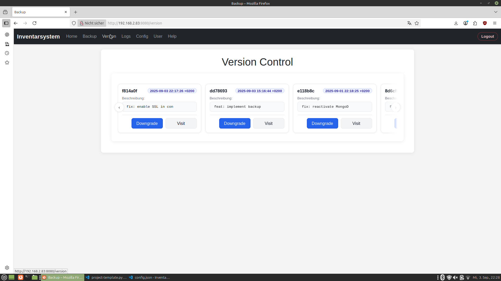

# Inventarsystem – Admin Oberfläche (Python)

[](https://wakatime.com/badge/user/30b8509f-5e17-4d16-b6b8-3ca0f3f936d3/project/4ea71c4f-0f6f-4cf9-881b-20a86494b32c)


Willkommen zur Admin-Oberfläche des Inventarsystems. Diese Web-App ermöglicht Administratoren die Verwaltung von Benutzern, Backups, Protokollen, Versionen sowie der Systemkonfiguration.

## Inhaltsverzeichnis
- Überblick
- Screenshots
- Installation & Start
- Anmeldung
- Funktionen im Detail
- Konfiguration (config.json)
- Backup & Wiederherstellung
- Versionen verwalten
- Hilfe & Support

## Überblick
Die Anwendung ist eine Flask-basierte Weboberfläche. Sie bietet schnelle Einsicht in Systemstatus, bequeme Administration und hilfreiche Werkzeuge zur Fehlerbehebung.


## Screenshots
- Login

	

- Hilfe

	

- Konfiguration

	

- Protokolle

	

- Backup

	

- Versionen

	

- Benutzerverwaltung

	
	

## Installation & Start
Voraussetzungen:
- Python 3.10+
- Linux-Umgebung (empfohlen)

Schritte (Beispiel):
1) Projektverzeichnis klonen/kopieren
2) Abhängigkeiten installieren (siehe `requirements.txt`)
3) Anwendung starten

## Anmeldung
Die Anmeldung erfolgt aktuell via TOTP (Zeit-basierter Einmalcode). Scannen Sie den QR-Code (siehe Route `/assdi`) mit einer Authenticator-App und geben Sie den Code im Login ein.


## Funktionen im Detail
- Home: Schnellzugriffe und Status.
- Hilfe: Umfangreiche Dokumentation mit Suche.
- Konfiguration: Anpassung von Schlüsseln, Intervallen, Upload-Limits, erlaubten Dateiendungen und Schulstunden.
- Protokolle: Einsicht und Download von Logs.
- Backup: Liste der Backups, Download und manuelles Anstoßen.
- Versionen: Anzeigen und Downgraden/Wechseln auf bestimmte Commits (via Skripte).
- Benutzerverwaltung: Admin-Accounts anlegen und (nach TOTP) löschen.

## Konfiguration (config.json)
Beispiel-Konfiguration:

```json
{
	"dbg": false,
	"key": "123457",
	"ver": "2.6.2",
	"host": "0.0.0.0",
	"port": 443,
	"mongodb": { "host": "localhost", "port": 27017, "db": "Inventarsystem" },
	"scheduler": { "enabled": true, "interval_minutes": 1, "backup_interval_hours": 24 },
	"ssl": { "enabled": true, "cert": "Web/certs/cert.pem", "key": "Web/certs/key.pem" },
	"images": { "thumbnail_size": [150,150], "preview_size": [400,400] },
	"upload": { "max_size_mb": 10, "image_max_size_mb": 15, "video_max_size_mb": 100 },
	"paths": { "backups": "backups", "logs": "logs" },
	"allowed_extensions": ["png","jpg","jpeg","gif","hevc","heif","mp4","mov","avi","mkv","webm","mp3","wav","ogg","flac","aac","m4a","opus","pdf","docx","xlsx","pptx","txt"],
	"schoolPeriods": {
		"1": { "start": "08:00", "end": "08:45", "label": "1. Stunde (08:00 - 08:45)" }
	}
}
```

Hinweise:
- Schlüssel/Intervalle/Größen werden direkt in der Oberfläche unter „Konfiguration“ gepflegt.
- Erlaubte Dateiendungen ohne führenden Punkt angeben (z. B. `png`, nicht `.png`).
- Schulstunden werden mit Start/Ende gepflegt; die Beschriftung wird automatisch erzeugt.

## Backup & Wiederherstellung
- Backups liegen unter `/var/backups/` (z. B. `Inventarsystem-YYYY-MM-DD.tar.gz`).
- Backups können im UI heruntergeladen und via Skript wiederhergestellt werden.


## Versionen verwalten
Die Seite „Version“ zeigt die letzten Commits. Über die Skripte (z. B. `manage-version.sh`) kann auf eine bestimmte Version gewechselt werden.


## Hilfe & Support
- Nutzen Sie die integrierte Hilfe-Seite mit Suchfunktion für Anleitungen, Wartung und Fehlerbehebung.
- Bei Fragen oder Problemen bitte ein Issue im Repository eröffnen.

